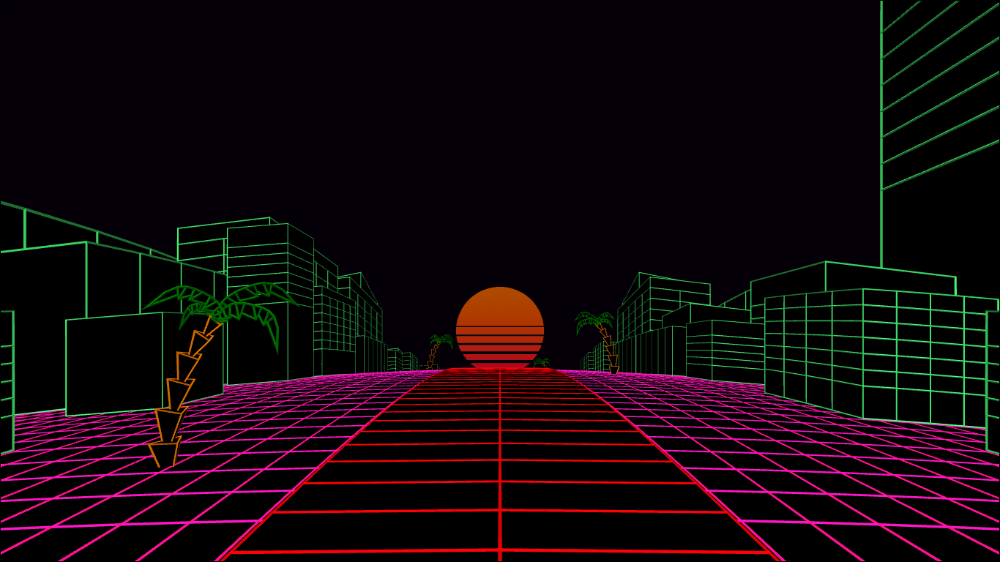

# Visualizador de Músicas usando WebGL e Javascript.

Anima objetos em um cenário 3D de uma rodovia de acordo com a música que está sendo reproduzida.
Permite a seleção de músicas a partir de arquivos.
É possivel também alterar alguns parâmetros referentes ao cenário, como velocidade, posição da cÂmera, troca de cores, curvatura do espaço, entre outras.

O cenário é animado usando shaders para curvar/alterar escala.

https://gustavohubner.github.io/VisualizadorMusicaWebGL/

